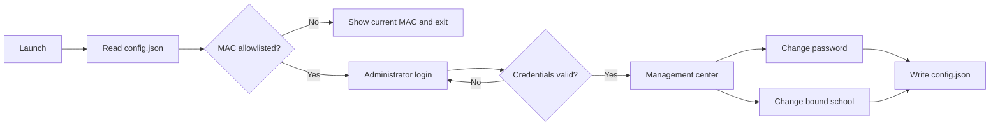

<div align="center">


# AccountBindSchool

A local desktop prototype built with Python and CustomTkinter for device allowlisting, administrator login, password changes, and school binding management.

[简体中文](README.md) · [Report an issue](https://github.com/ArcPZY/AccountBindSchool/issues) · [Contributing](#contributing)


</div>

> [!IMPORTANT]
> This project is a local prototype, not a production-grade identity or access-control system. Passwords are stored in plaintext inside `config.json`, and a MAC address is not a reliable security boundary. Read [Security boundaries](#security-boundaries) before using or extending the project.

## Overview

AccountBindSchool wraps a single administrator account and a categorized school list in a guided desktop interface. On startup, it performs device validation, administrator login, and account management in sequence. Every change is persisted to a local JSON file, so the full flow can be explored without a database or backend service.

It is best suited for:

- learning and prototyping CustomTkinter desktop applications;
- demonstrating school-binding and device-admission workflows;
- serving as a local UI skeleton before a real backend API is connected.

## Features

| Capability | Current implementation |
| --- | --- |
| Device validation | Reads the local MAC address and performs an exact allowlist match |
| Administrator login | Checks one administrator account stored in `config.json` |
| Password change | Verifies the old password and confirmation; requires at least 6 characters |
| School binding | Builds tabs from school categories and updates the current binding |
| Local persistence | Reads and writes account, school, and allowlist data as UTF-8 JSON |
| API extension points | Password and school update methods exist, but make no network requests yet |

## Workflow



## Quick start

### 1. Get the project

```bash
git clone https://github.com/ArcPZY/AccountBindSchool.git
cd AccountBindSchool
```

### 2. Create a virtual environment

Windows PowerShell:

```powershell
python -m venv .venv
.\.venv\Scripts\Activate.ps1
```

macOS / Linux:

```bash
python3 -m venv .venv
source .venv/bin/activate
```

### 3. Install dependencies

```bash
python -m pip install -r requirements.txt
```

### 4. Create a local configuration

Windows PowerShell:

```powershell
Copy-Item config.example.json config.json
```

macOS / Linux:

```bash
cp config.example.json config.json
```

Git ignores `config.json`, which holds the local MAC address, password, and runtime changes. `config.example.json` is the safe, committed template.

### 5. Allowlist the current device

Print the MAC address in the exact format used by the application:

```bash
python -c "from utils.mac_validator import get_mac_address; print(get_mac_address())"
```

Add the output to the `mac_whitelist` array in `config.json`. Matching is currently case-sensitive, so preserve the uppercase, colon-separated format printed by the command.

```json
{
  "mac_whitelist": ["AA:BB:CC:DD:EE:FF"]
}
```

### 6. Run

```bash
python main.py
```

The sample configuration uses `admin` / `change-me`. Change these credentials immediately after your first login, and never commit real passwords or device identifiers to a public repository.

## Configuration

The application reads `config.json` from the working directory and writes all changes back to the same file. If the file is absent, the application generates a local default configuration; explicitly copying `config.example.json` is still recommended so the device can be allowlisted before startup.

| Field | Type | Description |
| --- | --- | --- |
| `mac_whitelist` | `string[]` | MAC addresses allowed to use the application |
| `admin_account.username` | `string` | Local administrator username |
| `admin_account.password` | `string` | Plaintext local password; suitable for demos only |
| `admin_account.bound_school` | `string` | Currently bound school |
| `schools` | `object` | Schools grouped by type; each key becomes a UI tab |
| `api_config` | `object` | Reserved API base URL and endpoints; currently unused |

Minimal example:

```json
{
  "mac_whitelist": ["AA:BB:CC:DD:EE:FF"],
  "admin_account": {
    "username": "admin",
    "password": "change-me",
    "bound_school": "Example School"
  },
  "schools": {
    "Public": ["Example School"],
    "Private": ["Example Academy"],
    "Vocational": ["Example Technical College"]
  },
  "api_config": {
    "base_url": "https://api.example.com",
    "endpoints": {
      "change_password": "/admin/password",
      "change_school": "/admin/school"
    }
  }
}
```

## Project structure

```text
AccountBindSchool/
├── main.py                    # Application entry point
├── config.example.json        # Safe, committed configuration template
├── config.json                # Local data and configuration (Git-ignored)
├── requirements.txt           # Python dependencies
├── LICENSE                    # MIT license
├── README.md                  # Chinese documentation
├── README.en.md               # English documentation
├── docs/assets/               # README visual assets
├── ui/
│   ├── mac_check_window.py    # Device validation window
│   ├── login_window.py        # Login window
│   ├── main_window.py         # Management center
│   ├── change_password.py     # Password dialog
│   └── change_school.py       # School selection dialog
└── utils/
    ├── mac_validator.py       # MAC retrieval and validation
    └── data_manager.py        # JSON persistence and business rules
```

The UI layer owns windows and interaction. `DataManager` centralizes persistence and business validation, while `mac_validator` handles the device identifier. Backend integration can start at `DataManager._api_change_password()` and `DataManager._api_change_school()`.

## Security boundaries

The implementation is intentionally simple. Be aware of these limitations before extending it:

- passwords are stored and compared in plaintext, without hashing, salting, or key management;
- MAC addresses can be spoofed, and a local allowlist can be edited directly;
- `config.json` has no encryption, file locking, atomic writes, or permission isolation;
- the API methods are stubs, so every operation affects only the local file;
- the repository does not yet include automated tests, audit logging, or a multi-user authorization model.

A production version needs server-side authentication, password hashing, a trustworthy device identity mechanism, configuration validation, atomic persistence, audit trails, and automated tests.

## Development and verification

There is no automated test suite yet. At minimum, run a syntax check and manually exercise the primary flow before submitting changes:

```bash
python -m compileall -q main.py ui utils
python main.py
```

Recommended manual cases include an unauthorized device, failed login, mismatched new passwords, an incorrect old password, switching schools, and persistence after a restart.

## Contributing

Bug reports and focused improvements are welcome through [GitHub Issues](https://github.com/ArcPZY/AccountBindSchool/issues). For code contributions:

1. Fork the repository and create a focused branch from the current default branch.
2. Keep the change as small as the issue allows.
3. Complete the checks above and do not commit real passwords, MAC addresses, or other sensitive configuration.
4. Open a pull request explaining the problem, solution, and verification. Include screenshots or a short video for UI changes.

## FAQ

<details>
<summary><strong>Why does device validation keep failing?</strong></summary>

Use the Python command in Quick start to obtain the MAC address and make sure it exactly matches an entry in `mac_whitelist`. Matching is case-sensitive.

</details>

<details>
<summary><strong>Why did editing config.json not update the UI?</strong></summary>

`DataManager` caches configuration in memory for the life of the process. Exit the application completely and start it again. The management center's Refresh button only refreshes account information from memory.

</details>

<details>
<summary><strong>How do I add another school category?</strong></summary>

Add a new key and school array to the `schools` object. The UI creates a tab from each key automatically; no UI code changes are required.

</details>

## License

This project is available under the [MIT License](LICENSE). Copyright © 2026 ArcPZY.

---

If the project helps you, consider starring it. If something breaks, open a reproducible issue.
