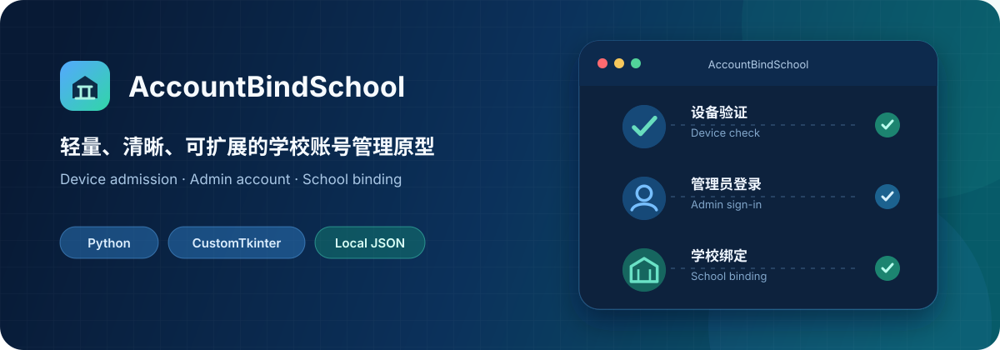
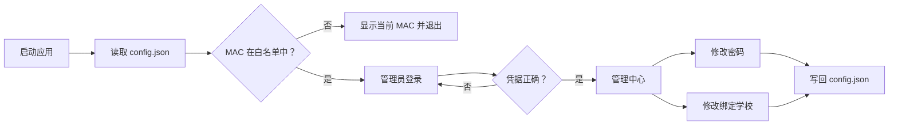

<div align="center">



# AccountBindSchool

一个基于 Python 与 CustomTkinter 的本地桌面工具，用于演示设备白名单校验、管理员登录、密码修改与学校绑定管理。

[English](README.en.md) · [报告问题](https://github.com/ArcPZY/AccountBindSchool/issues) · [参与贡献](#参与贡献)


</div>

> [!IMPORTANT]
> 本项目当前是本地原型，不是生产级账号或访问控制系统。密码以明文保存在 `config.json` 中，MAC 地址也不能作为可靠的安全边界。请先阅读[安全边界](#安全边界)，不要直接用于真实业务。

## 项目简介

AccountBindSchool 将一个简单的管理员配置和学校列表封装成向导式桌面界面。程序启动后依次完成设备校验、管理员登录和账号管理，所有变更都会写回本地 JSON 文件，无需数据库或后端服务即可体验完整流程。

它适合用于：

- CustomTkinter 桌面应用学习与原型验证；
- 学校绑定、设备准入等交互流程演示；
- 接入真实后端 API 前的本地 UI 骨架。

## 功能

| 能力 | 当前实现 |
| --- | --- |
| 设备校验 | 读取本机 MAC 地址并与本地白名单精确匹配 |
| 管理员登录 | 使用 `config.json` 中的单个管理员账号验证凭据 |
| 修改密码 | 校验旧密码、检查两次输入，新密码至少 6 位 |
| 学校绑定 | 按学校类型动态生成标签页并更新当前绑定学校 |
| 本地持久化 | 以 UTF-8 JSON 读取和保存账号、学校及白名单配置 |
| API 扩展点 | 已保留密码与学校变更方法，但尚未发起网络请求 |

## 工作流程



## 快速开始

### 1. 获取项目

```bash
git clone https://github.com/ArcPZY/AccountBindSchool.git
cd AccountBindSchool
```

### 2. 创建虚拟环境

Windows PowerShell：

```powershell
python -m venv .venv
.\.venv\Scripts\Activate.ps1
```

macOS / Linux：

```bash
python3 -m venv .venv
source .venv/bin/activate
```

### 3. 安装依赖

```bash
python -m pip install -r requirements.txt
```

### 4. 创建本地配置

Windows PowerShell：

```powershell
Copy-Item config.example.json config.json
```

macOS / Linux：

```bash
cp config.example.json config.json
```

`config.json` 已被 Git 忽略，用于保存本机 MAC、密码和运行时变更；`config.example.json` 是可以安全提交的配置模板。

### 5. 授权当前设备

先获取程序实际识别到的 MAC 地址：

```bash
python -c "from utils.mac_validator import get_mac_address; print(get_mac_address())"
```

将输出值加入 `config.json` 的 `mac_whitelist` 数组。当前实现使用区分大小写的精确匹配，因此请保留程序输出的“大写字母 + 冒号”格式。

```json
{
  "mac_whitelist": ["AA:BB:CC:DD:EE:FF"]
}
```

### 6. 启动

```bash
python main.py
```

示例配置中的初始凭据为 `admin` / `change-me`。首次登录后请立即修改；不要在公开仓库中提交真实密码或设备标识。

## 配置说明

程序从运行目录读取 `config.json`，写操作也会直接更新该文件。若文件不存在，程序会生成一份本地默认配置；推荐仍从 `config.example.json` 显式复制，以便在启动前加入设备白名单。

| 字段 | 类型 | 说明 |
| --- | --- | --- |
| `mac_whitelist` | `string[]` | 允许使用程序的 MAC 地址列表 |
| `admin_account.username` | `string` | 本地管理员用户名 |
| `admin_account.password` | `string` | 本地管理员明文密码，仅适用于演示 |
| `admin_account.bound_school` | `string` | 当前绑定学校 |
| `schools` | `object` | 按类型分组的学校列表；键会自动成为 UI 标签页 |
| `api_config` | `object` | 预留的 API 地址与端点；当前代码不会调用 |

最小示例：

```json
{
  "mac_whitelist": ["AA:BB:CC:DD:EE:FF"],
  "admin_account": {
    "username": "admin",
    "password": "change-me",
    "bound_school": "示例学校"
  },
  "schools": {
    "公办": ["示例学校"],
    "民办": ["示例实验学校"],
    "高职": ["示例职业学院"]
  },
  "api_config": {
    "base_url": "https://api.example.com",
    "endpoints": {
      "change_password": "/admin/password",
      "change_school": "/admin/school"
    }
  }
}
```

## 项目结构

```text
AccountBindSchool/
├── main.py                    # 程序入口
├── config.example.json        # 可提交的安全配置模板
├── config.json                # 本地数据与配置（Git 忽略）
├── requirements.txt           # Python 依赖
├── LICENSE                    # MIT 许可证
├── README.md                  # 中文文档
├── README.en.md               # English documentation
├── docs/assets/               # README 视觉素材
├── ui/
│   ├── mac_check_window.py    # 设备校验窗口
│   ├── login_window.py        # 登录窗口
│   ├── main_window.py         # 管理中心
│   ├── change_password.py     # 修改密码对话框
│   └── change_school.py       # 修改学校对话框
└── utils/
    ├── mac_validator.py       # MAC 获取与校验
    └── data_manager.py        # JSON 读写与业务逻辑
```

UI 层只负责窗口和交互，`DataManager` 集中处理配置读写与业务校验，`mac_validator` 封装设备标识获取。后续接入后端时，可从 `DataManager._api_change_password()` 与 `DataManager._api_change_school()` 两个扩展点开始。

## 安全边界

当前实现有意保持简单，请在二次开发前了解以下限制：

- 密码以明文存储和比较，没有哈希、加盐或密钥管理；
- MAC 地址可以被伪造，本地白名单也可以被直接修改；
- `config.json` 没有加密、文件锁、原子写入或权限隔离；
- API 方法仍是空实现，所有操作只影响本地文件；
- 仓库尚未包含自动化测试、审计日志和多用户权限模型。

生产化至少需要服务端鉴权、密码哈希、可靠的设备身份方案、配置校验、原子持久化、审计记录以及自动化测试。

## 开发与验证

本项目暂未配置自动化测试。提交前至少执行语法检查并手动走通主流程：

```bash
python -m compileall -q main.py ui utils
python main.py
```

建议手动验证：未授权设备、错误登录、密码不一致、旧密码错误、学校切换和程序重启后的数据持久化。

## 参与贡献

欢迎通过 [Issues](https://github.com/ArcPZY/AccountBindSchool/issues) 报告问题或提出改进建议。提交代码时：

1. Fork 仓库并从当前主分支创建功能分支；
2. 只提交与问题相关的最小改动；
3. 完成上面的验证，并避免提交真实密码、MAC 地址或其他敏感配置；
4. 创建 Pull Request，说明问题、解决方式和验证结果；涉及 UI 时请附截图或短视频。

## 常见问题

<details>
<summary><strong>设备校验一直失败？</strong></summary>

使用快速开始中的 Python 命令获取 MAC 地址，确认它与 `mac_whitelist` 中的值完全一致。当前比较区分大小写。

</details>

<details>
<summary><strong>修改了 config.json，但界面没有更新？</strong></summary>

`DataManager` 在进程内缓存配置。完全退出并重新启动应用后再检查；管理中心的“刷新”只刷新内存中的账号信息。

</details>

<details>
<summary><strong>如何添加新的学校类型？</strong></summary>

直接在 `schools` 对象中增加键和学校数组。程序会根据键名动态创建新的标签页，无需修改 UI 代码。

</details>

## 许可证

本项目基于 [MIT License](LICENSE) 开源，版权归 © 2026 ArcPZY 所有。

---

如果这个项目对你有帮助，欢迎 Star；如果发现问题，请提交一个可复现的 Issue。
